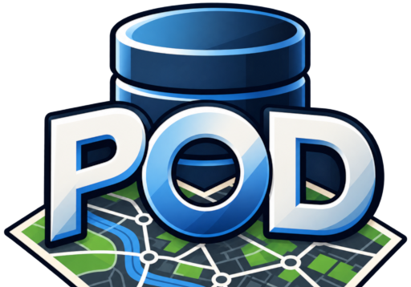

  
  <h1>PostOverpassDark</h1>
  

    <a href="https://atarom.github.io/PostOverpassDark/">
      <strong>Abrir la aplicación ↗</strong>
    </a>
  

---

## Funciones

- Consultas mediante **Overpass API** y **Postpass**.
- Editor con resaltado, autocompletado y presets de ejemplo.
- Variables compatibles con consultas como `{{bbox}}`, `{{center}}`, `{{geocodeArea:...}}`...
- Visualización normal o como mapa de calor.
- Conteo de keys y valores de los tags devueltos.
- Filtro por regex sobre la key seleccionada, con colores configurables.
- Filtro numérico por key con rango mínimo/máximo y visualización opcional de valores fuera de rango.
- Inspección de la consulta enviada, respuesta original y GeoJSON generado.
- Acceso directo desde los resultados a OpenStreetMap y distintos editores OSM.

## Tecnologías y datos

- [OpenLayers](https://openlayers.org/) — renderización WebGL, filtros dinámicos y navegación del mapa.
- [OpenStreetMap](https://www.openstreetmap.org/) — teselas del mapa base con estilo oscuro.
- [Overpass API](https://overpass-api.de/) — consultas Overpass QL sobre datos de OpenStreetMap.
- [Postpass](https://postpass.geofabrik.de/) — consultas SQL/PostGIS sobre datos de OpenStreetMap.
- [CodeMirror](https://codemirror.net/) — editor de consultas.
- [osmtogeojson](https://github.com/tyrasd/osmtogeojson) — conversión de respuestas OSM a GeoJSON.
- [Nominatim](https://nominatim.org/) — resolución de áreas para `{{geocodeArea:...}}`.
- [OpenStreetMap contributors](https://www.openstreetmap.org/copyright) — datos disponibles bajo licencia ODbL.
